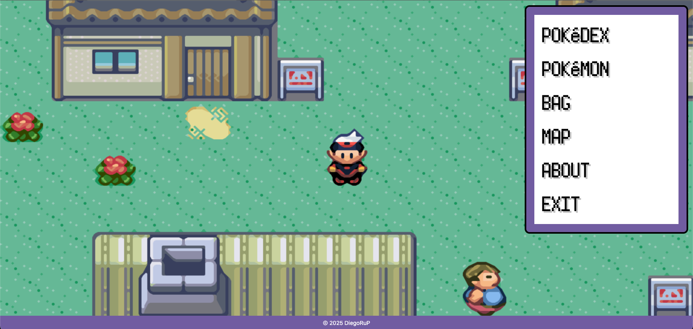
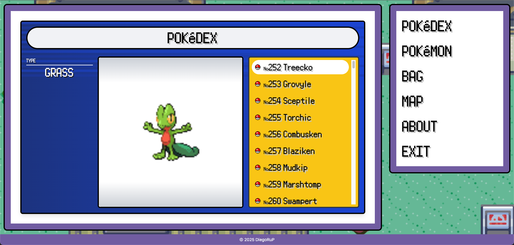
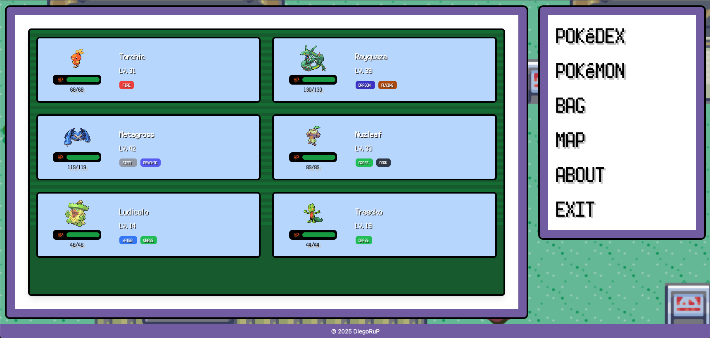
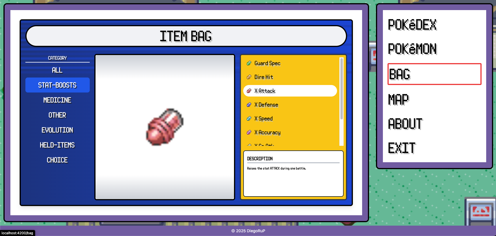

# Pokémon Ruby Style Menu


A nostalgic recreation of the Pokémon Ruby/Sapphire game menu system built with modern web technologies. This project uses Angular 17.3, Tailwind CSS, and the PokéAPI to deliver an authentic Pokémon experience right in your browser.

## ✨ Features

- **Authentic Ruby/Sapphire Menu Experience**: Recreates the nostalgic feel of the original GBA games
- **Responsive Design**: Works on desktop and mobile devices
- **Real Pokémon Data**: Powered by the PokéAPI for authentic Pokémon information
- **Menu Options**:
  - 📱 **Pokédex**: Browse and search for Pokémon
  - 🐉 **Pokémon Team**: View and manage your team
  - 🎒 **Bag**: Check your items
  - 🗺️ **Map**: Explore the region
  - ℹ️ **About**: Information about the project
  - 🚪 **Exit**: Close the menu

## 📸 Screenshots






## 🛠️ Technologies Used

- **Angular 17.3**: Utilizing the latest features and performance improvements
- **Tailwind CSS**: For responsive and customized styling
- **PokéAPI**: RESTful API for accurate Pokémon data

## 🚀 Getting Started

### Prerequisites

- Node.js (v16+)
- npm or yarn

### Installation

1. Clone the repository:
   ```bash
   git clone https://github.com/DiegoRuP/pokeRuby.git
   cd pokeRuby
   ```

2. Install dependencies:
   ```bash
   npm install
   ```

3. Start the development server:
   ```bash
   ng serve
   ```

4. Open your browser and navigate to `http://localhost:4200`

---

⭐ This project is not affiliated with Nintendo or The Pokémon Company. Pokémon and Pokémon character names are trademarks of Nintendo.
